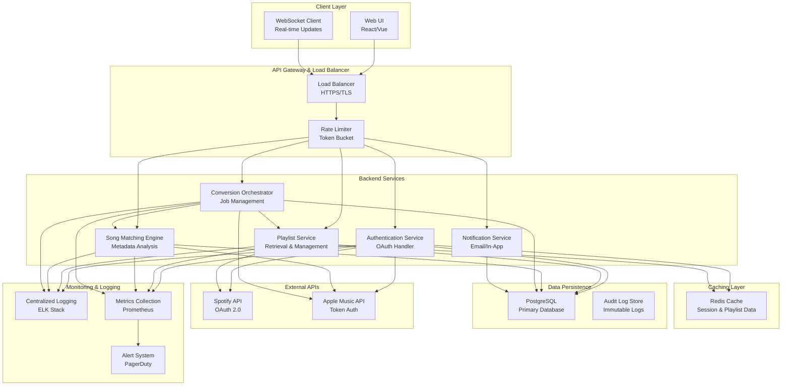
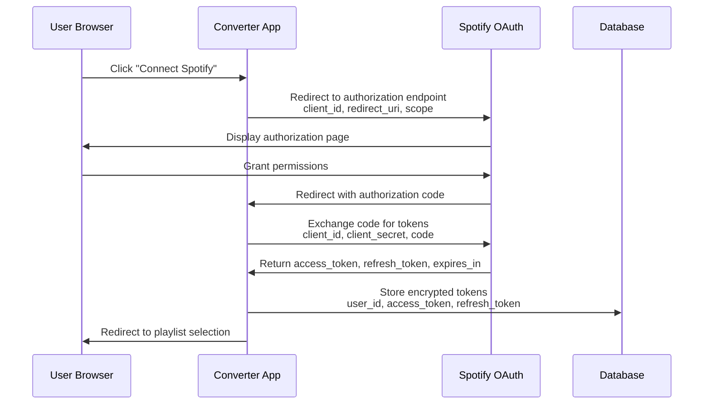
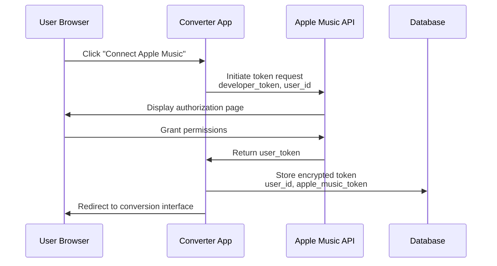
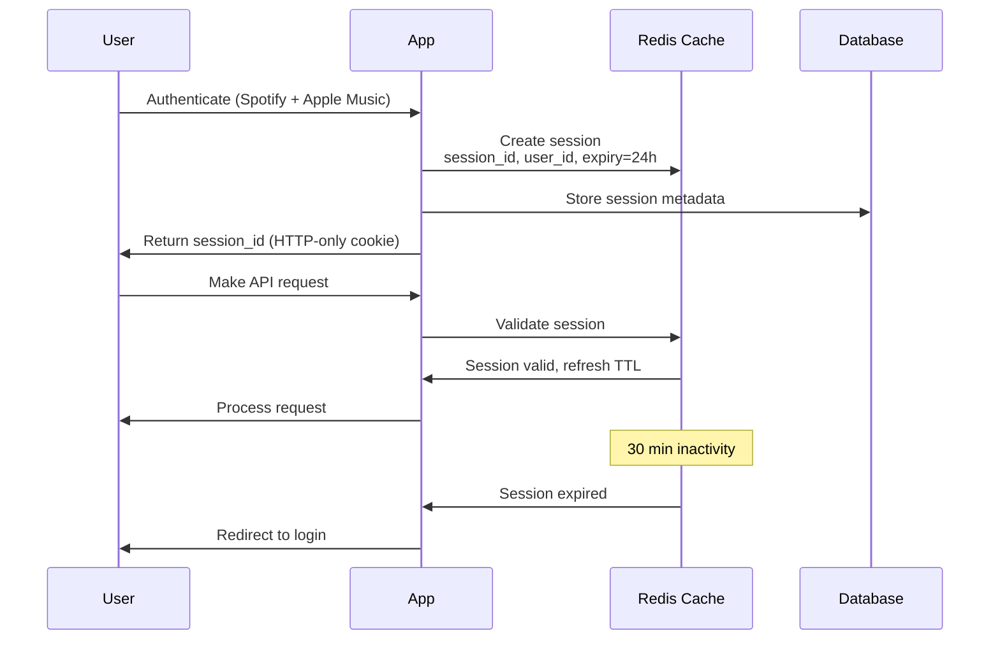
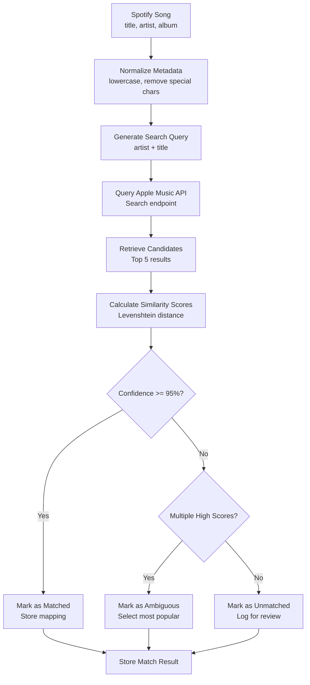
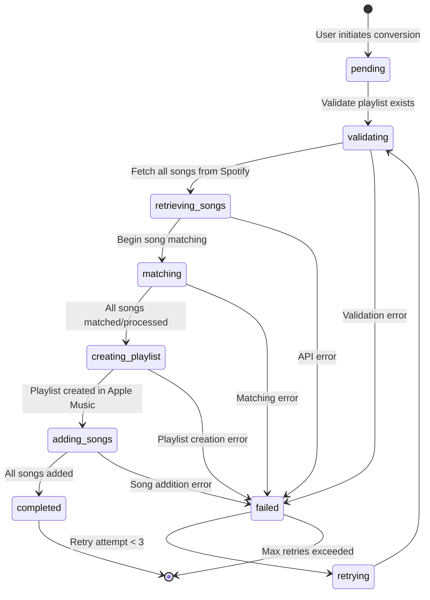
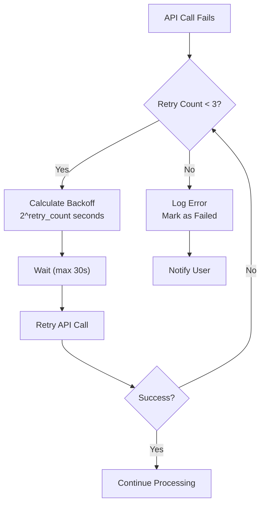
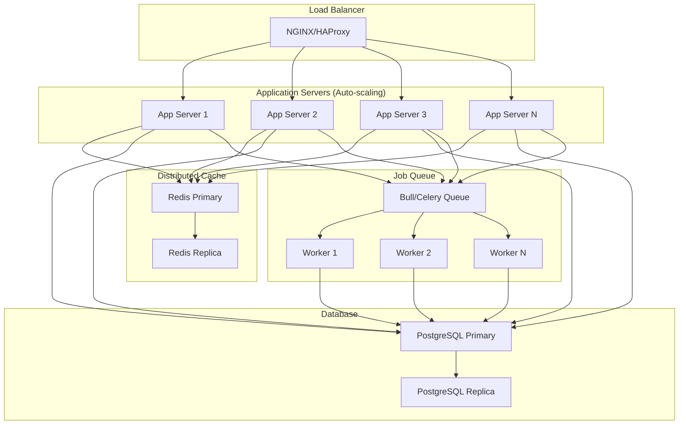

# Design Document: Spotify to Apple Music Playlist Converter

## Overview

The Spotify to Apple Music Playlist Converter is a web application that enables seamless transfer of music playlists between streaming platforms. The system orchestrates OAuth authentication with both Spotify and Apple Music, retrieves user playlists, performs intelligent song matching using metadata analysis, and creates equivalent playlists in the destination platform. The architecture prioritizes security (encrypted token storage), scalability (concurrent conversion jobs), and reliability (automatic retry mechanisms with exponential backoff).

## System Architecture

### High-Level Architecture Diagram



### Technology Stack

**Frontend:**
- React or Vue.js for responsive UI
- WebSocket for real-time progress updates
- Axios/Fetch for API communication
- WCAG 2.1 AA compliant components

**Backend:**
- Node.js/Express or Python/FastAPI for REST API
- PostgreSQL for persistent data storage
- Redis for session management and caching
- Bull/Celery for async job queues

**Infrastructure:**
- Docker for containerization
- Kubernetes for orchestration and scaling
- NGINX for load balancing and reverse proxy
- ELK Stack (Elasticsearch, Logstash, Kibana) for centralized logging
- Prometheus for metrics collection

## Authentication and Session Management Flow

### Spotify OAuth Flow



### Apple Music Token Authentication Flow



### Session Management



## API Integration Points

### Spotify API Integration

**Authentication:**
- OAuth 2.0 with authorization code flow
- Scopes: `playlist-read-private`, `playlist-read-collaborative`, `user-library-read`
- Rate limit: 180 requests per 15 minutes (standard tier)

**Key Endpoints:**
- `GET /v1/me` - Get current user profile
- `GET /v1/me/playlists` - List user playlists (paginated, max 50 per request)
- `GET /v1/playlists/{playlist_id}/tracks` - Get playlist songs (paginated, max 100 per request)
- `GET /v1/search` - Search for songs

**Token Refresh:**
```
POST https://accounts.spotify.com/api/token
Content-Type: application/x-www-form-urlencoded

grant_type=refresh_token&refresh_token={refresh_token}&client_id={client_id}&client_secret={client_secret}
```

### Apple Music API Integration

**Authentication:**
- Token-based authentication with developer token and user token
- Developer token: JWT signed with private key (valid 6 months)
- User token: Obtained after user authorization

**Key Endpoints:**
- `GET /v1/me/library/playlists` - List user playlists
- `POST /v1/me/library/playlists` - Create new playlist
- `POST /v1/me/library/playlists/{playlist_id}/tracks` - Add songs to playlist
- `GET /v1/catalog/{storefront}/songs` - Search for songs

**Request Headers:**
```
Authorization: Bearer {developer_token}
Music-User-Token: {user_token}
```

## Song Matching Engine Architecture

### Matching Algorithm



### Matching Scoring Algorithm

For each candidate song returned from Apple Music API:

```
similarity_score = (
    0.4 * title_similarity +
    0.4 * artist_similarity +
    0.2 * album_similarity
)

where:
  title_similarity = 1 - (levenshtein_distance(spotify_title, candidate_title) / max_length)
  artist_similarity = 1 - (levenshtein_distance(spotify_artist, candidate_artist) / max_length)
  album_similarity = 1 - (levenshtein_distance(spotify_album, candidate_album) / max_length)
```

**Confidence Thresholds:**
- High confidence (matched): ≥ 0.95
- Medium confidence (ambiguous): 0.85 - 0.94
- Low confidence (unmatched): < 0.85

### Matching Performance Optimization

- **Batch Processing**: Process songs in batches of 10 to optimize API calls
- **Caching**: Cache matching results for 30 days to avoid re-matching
- **Parallel Processing**: Use worker threads/processes for concurrent matching (10 songs/second target)
- **Early Termination**: Stop searching if first result has > 0.98 confidence

## Database Schema

### Core Tables

**users**
```sql
CREATE TABLE users (
  id UUID PRIMARY KEY DEFAULT gen_random_uuid(),
  spotify_user_id VARCHAR(255) UNIQUE NOT NULL,
  apple_music_user_id VARCHAR(255),
  email VARCHAR(255) UNIQUE NOT NULL,
  created_at TIMESTAMP DEFAULT CURRENT_TIMESTAMP,
  updated_at TIMESTAMP DEFAULT CURRENT_TIMESTAMP,
  deleted_at TIMESTAMP,
  INDEX idx_spotify_user_id (spotify_user_id),
  INDEX idx_apple_music_user_id (apple_music_user_id)
);
```

**sessions**
```sql
CREATE TABLE sessions (
  id UUID PRIMARY KEY DEFAULT gen_random_uuid(),
  user_id UUID NOT NULL REFERENCES users(id) ON DELETE CASCADE,
  session_token VARCHAR(255) UNIQUE NOT NULL,
  spotify_access_token TEXT ENCRYPTED,
  spotify_refresh_token TEXT ENCRYPTED,
  spotify_token_expires_at TIMESTAMP,
  apple_music_token TEXT ENCRYPTED,
  apple_music_token_expires_at TIMESTAMP,
  ip_address INET,
  user_agent TEXT,
  created_at TIMESTAMP DEFAULT CURRENT_TIMESTAMP,
  expires_at TIMESTAMP NOT NULL,
  last_activity_at TIMESTAMP DEFAULT CURRENT_TIMESTAMP,
  INDEX idx_user_id (user_id),
  INDEX idx_session_token (session_token),
  INDEX idx_expires_at (expires_at)
);
```

**playlists**
```sql
CREATE TABLE playlists (
  id UUID PRIMARY KEY DEFAULT gen_random_uuid(),
  user_id UUID NOT NULL REFERENCES users(id) ON DELETE CASCADE,
  spotify_playlist_id VARCHAR(255) NOT NULL,
  spotify_playlist_name VARCHAR(255) NOT NULL,
  spotify_playlist_description TEXT,
  spotify_playlist_image_url TEXT,
  spotify_playlist_public BOOLEAN DEFAULT FALSE,
  song_count INTEGER NOT NULL,
  cached_at TIMESTAMP DEFAULT CURRENT_TIMESTAMP,
  INDEX idx_user_id (user_id),
  INDEX idx_spotify_playlist_id (spotify_playlist_id),
  UNIQUE(user_id, spotify_playlist_id)
);
```

**conversion_jobs**
```sql
CREATE TABLE conversion_jobs (
  id UUID PRIMARY KEY DEFAULT gen_random_uuid(),
  user_id UUID NOT NULL REFERENCES users(id) ON DELETE CASCADE,
  spotify_playlist_id VARCHAR(255) NOT NULL,
  apple_music_playlist_id VARCHAR(255),
  apple_music_playlist_name VARCHAR(255),
  status VARCHAR(50) NOT NULL DEFAULT 'pending',
  total_songs INTEGER NOT NULL,
  matched_songs INTEGER DEFAULT 0,
  unmatched_songs INTEGER DEFAULT 0,
  ambiguous_songs INTEGER DEFAULT 0,
  started_at TIMESTAMP,
  completed_at TIMESTAMP,
  error_message TEXT,
  retry_count INTEGER DEFAULT 0,
  created_at TIMESTAMP DEFAULT CURRENT_TIMESTAMP,
  updated_at TIMESTAMP DEFAULT CURRENT_TIMESTAMP,
  INDEX idx_user_id (user_id),
  INDEX idx_status (status),
  INDEX idx_created_at (created_at)
);
```

**song_matches**
```sql
CREATE TABLE song_matches (
  id UUID PRIMARY KEY DEFAULT gen_random_uuid(),
  conversion_job_id UUID NOT NULL REFERENCES conversion_jobs(id) ON DELETE CASCADE,
  spotify_song_id VARCHAR(255) NOT NULL,
  spotify_song_title VARCHAR(255) NOT NULL,
  spotify_song_artist VARCHAR(255) NOT NULL,
  spotify_song_album VARCHAR(255),
  apple_music_song_id VARCHAR(255),
  apple_music_song_title VARCHAR(255),
  apple_music_song_artist VARCHAR(255),
  match_status VARCHAR(50) NOT NULL,
  confidence_score DECIMAL(3,2),
  match_reason TEXT,
  created_at TIMESTAMP DEFAULT CURRENT_TIMESTAMP,
  INDEX idx_conversion_job_id (conversion_job_id),
  INDEX idx_match_status (match_status)
);
```

**audit_logs**
```sql
CREATE TABLE audit_logs (
  id UUID PRIMARY KEY DEFAULT gen_random_uuid(),
  user_id UUID REFERENCES users(id) ON DELETE SET NULL,
  action VARCHAR(255) NOT NULL,
  resource_type VARCHAR(100) NOT NULL,
  resource_id VARCHAR(255),
  details JSONB,
  ip_address INET,
  created_at TIMESTAMP DEFAULT CURRENT_TIMESTAMP,
  INDEX idx_user_id (user_id),
  INDEX idx_action (action),
  INDEX idx_created_at (created_at)
);
```

**api_rate_limits**
```sql
CREATE TABLE api_rate_limits (
  id UUID PRIMARY KEY DEFAULT gen_random_uuid(),
  user_id UUID NOT NULL REFERENCES users(id) ON DELETE CASCADE,
  api_provider VARCHAR(50) NOT NULL,
  request_count INTEGER DEFAULT 0,
  window_start TIMESTAMP NOT NULL,
  window_end TIMESTAMP NOT NULL,
  UNIQUE(user_id, api_provider, window_start),
  INDEX idx_user_id (user_id),
  INDEX idx_window_end (window_end)
);
```


## Conversion Workflow and Job Management

### Conversion Job State Machine



### Conversion Job Processing

**Step 1: Validation**
- Verify user has valid Spotify and Apple Music tokens
- Check playlist exists and is accessible
- Verify Apple Music account is ready

**Step 2: Song Retrieval**
- Fetch all songs from Spotify playlist with pagination
- Handle playlists with > 100 songs
- Store song metadata locally for matching

**Step 3: Song Matching**
- Process songs in batches of 10
- Query Apple Music API for each song
- Calculate similarity scores
- Store match results

**Step 4: Playlist Creation**
- Create new playlist in Apple Music
- Preserve name, description, visibility
- Handle duplicate playlist detection

**Step 5: Song Addition**
- Add matched songs to Apple Music playlist
- Maintain song order
- Skip unmatched songs

**Step 6: Completion**
- Generate conversion report
- Send notification to user
- Store conversion history

## Error Handling and Retry Mechanisms

### Retry Strategy



### Exponential Backoff Formula

```
backoff_time = min(2^retry_count + random(0, 1), 30) seconds

Retry Schedule:
  Attempt 1: Immediate
  Attempt 2: 2-3 seconds
  Attempt 3: 4-5 seconds
  Attempt 4: 8-9 seconds (if configured)
  Max wait: 30 seconds
```

### Error Categories and Handling

**Transient Errors (Retryable):**
- Network timeouts
- HTTP 429 (Rate Limited)
- HTTP 503 (Service Unavailable)
- HTTP 502 (Bad Gateway)
- Connection reset

**Permanent Errors (Non-Retryable):**
- HTTP 401 (Unauthorized) → Re-authenticate
- HTTP 403 (Forbidden) → Check permissions
- HTTP 404 (Not Found) → Log and skip
- HTTP 400 (Bad Request) → Log and skip
- Invalid token → Refresh token

**Partial Failure Handling:**
- Continue processing remaining songs
- Log failed songs with reasons
- Provide user with detailed report
- Allow manual retry for failed songs

## Security Architecture

### Token Storage and Encryption

**At Rest:**
- All tokens encrypted using AES-256-GCM
- Encryption key stored in secure key management service (AWS KMS, HashiCorp Vault)
- Separate encryption keys per environment (dev, staging, prod)
- Key rotation every 90 days

**In Transit:**
- All API communications over HTTPS/TLS 1.3
- Certificate pinning for external API calls
- Secure WebSocket (WSS) for real-time updates

**Token Lifecycle:**
```
1. Receive token from OAuth provider
2. Encrypt with AES-256-GCM
3. Store in database with encryption metadata
4. Use only in memory for API calls
5. Clear from memory after use
6. Refresh before expiration
7. Delete on logout or expiration
```

### Session Security

**Session ID Generation:**
```
session_id = base64(crypto.getRandomBytes(32))
// 256-bit cryptographically random value
```

**Session Storage:**
- Session ID stored in HTTP-only, Secure, SameSite=Strict cookie
- Session data stored in Redis with TTL
- Session metadata (IP, User-Agent) for anomaly detection

**Session Validation:**
- Verify session exists and not expired
- Check IP address consistency (optional, configurable)
- Verify User-Agent consistency (optional, configurable)
- Refresh TTL on each request

### Data Privacy Measures

**Personally Identifiable Information (PII):**
- Spotify user ID, Apple Music user ID, email
- Encrypted at rest
- Accessible only to authenticated user
- Audit logged for all access

**Sensitive Data:**
- OAuth tokens (encrypted)
- Refresh tokens (encrypted)
- User preferences (encrypted)

**Data Deletion:**
- User can request data deletion
- Soft delete (mark deleted_at timestamp)
- Hard delete after 30 days
- Audit log retained for compliance

**GDPR/CCPA Compliance:**
- Privacy policy displayed before authentication
- Explicit consent for data collection
- Right to access user data
- Right to delete user data
- Data portability support

## Scalability and Performance Considerations

### Horizontal Scaling Architecture



### Performance Targets

**API Response Times:**
- Playlist retrieval: < 500ms (p95)
- Song matching: < 100ms per song (p95)
- Conversion status: < 200ms (p95)
- Overall API: < 500ms (p95)

**Throughput:**
- Song matching: ≥ 10 songs/second
- Concurrent conversions: ≥ 100 jobs
- Concurrent users: ≥ 100 users
- Designed to scale to 10,000 concurrent users

**Resource Utilization:**
- CPU: < 70% under normal load
- Memory: < 80% under normal load
- Database connections: < 80% of pool size
- Redis memory: < 80% of allocated

### Caching Strategy

**Redis Cache Layers:**

1. **Session Cache** (TTL: 24 hours)
   - Session data
   - User authentication state
   - Token expiration times

2. **Playlist Cache** (TTL: 5 minutes)
   - User's Spotify playlists
   - Playlist metadata
   - Song counts

3. **Song Match Cache** (TTL: 30 days)
   - Spotify song → Apple Music song mappings
   - Confidence scores
   - Match timestamps

4. **API Response Cache** (TTL: varies)
   - Spotify API responses
   - Apple Music search results
   - User profile data

**Cache Invalidation:**
- Time-based expiration (TTL)
- Event-based invalidation (on conversion completion)
- Manual invalidation (admin operations)

### Database Optimization

**Indexing Strategy:**
- Primary keys on all tables
- Foreign key indexes for joins
- Composite indexes on frequently filtered columns
- Partial indexes for status-based queries

**Query Optimization:**
- Connection pooling (min: 10, max: 100)
- Query result pagination (default: 50 items)
- Lazy loading for large datasets
- Query timeout: 30 seconds

**Partitioning Strategy:**
- Partition conversion_jobs by created_at (monthly)
- Partition song_matches by conversion_job_id
- Partition audit_logs by created_at (monthly)

## Monitoring, Logging, and Observability

### Logging Strategy

**Log Levels:**
- ERROR: API failures, exceptions, critical issues
- WARN: Retries, rate limits, degraded performance
- INFO: Conversion milestones, user actions
- DEBUG: Detailed operation flow (dev/staging only)

**Log Format (JSON):**
```json
{
  "timestamp": "2024-01-15T10:30:45.123Z",
  "level": "INFO",
  "service": "conversion-service",
  "user_id": "uuid",
  "conversion_job_id": "uuid",
  "action": "song_matched",
  "details": {
    "spotify_song_id": "...",
    "apple_music_song_id": "...",
    "confidence_score": 0.98
  },
  "duration_ms": 145,
  "trace_id": "uuid"
}
```

**Log Retention:**
- Application logs: 90 days
- Audit logs: 1 year
- Error logs: 1 year
- Debug logs: 7 days

### Metrics Collection

**Key Metrics:**

1. **Conversion Metrics:**
   - Conversions started/completed/failed
   - Average conversion time
   - Songs matched/unmatched/ambiguous
   - Matching accuracy rate

2. **API Metrics:**
   - Request count by endpoint
   - Response time (p50, p95, p99)
   - Error rate by type
   - Rate limit hits

3. **System Metrics:**
   - CPU usage
   - Memory usage
   - Database connection pool utilization
   - Redis memory usage
   - Queue depth

4. **Business Metrics:**
   - Active users
   - Playlists converted
   - Total songs matched
   - User retention

### Alerting Rules

**Critical Alerts:**
- Error rate > 5% for 5 minutes
- API response time p95 > 2 seconds for 5 minutes
- Database connection pool > 90% for 5 minutes
- Redis memory > 90% for 5 minutes
- Conversion job failure rate > 10% for 10 minutes

**Warning Alerts:**
- Error rate > 2% for 10 minutes
- API response time p95 > 1 second for 10 minutes
- Queue depth > 1000 jobs
- Spotify API rate limit approaching

## Correctness Properties

### Property 1: Song Matching Idempotence

**Property:** FOR ALL Spotify songs in a playlist, matching the same song multiple times SHALL produce the same Apple Music song result.

**Formal Specification:**
```
∀ spotify_song ∈ playlist.songs:
  match(spotify_song) = match(spotify_song)
  
Invariant: If match(song) returns apple_music_song_id at time t1,
           then match(song) returns the same apple_music_song_id at time t2 > t1
           (unless cache expires and song is re-matched)
```

**Test Strategy:** Property-based testing with fast-check
- Generate random Spotify songs
- Match each song twice
- Verify results are identical

### Property 2: Playlist Preservation

**Property:** FOR ALL converted playlists, the number of songs in Apple Music SHALL be less than or equal to the number of songs in Spotify (due to unmatched songs).

**Formal Specification:**
```
∀ conversion_job:
  apple_music_playlist.song_count ≤ spotify_playlist.song_count
  
Specifically:
  apple_music_playlist.song_count = 
    conversion_job.matched_songs + conversion_job.ambiguous_songs
```

**Test Strategy:** Property-based testing
- Generate random playlists with 1-1000 songs
- Convert each playlist
- Verify Apple Music song count ≤ Spotify song count

### Property 3: Token Refresh Validity

**Property:** WHEN a token is refreshed, the new token SHALL be valid for API calls and the old token SHALL be invalidated.

**Formal Specification:**
```
∀ token ∈ {spotify_token, apple_music_token}:
  old_token = token
  new_token = refresh(old_token)
  
  Precondition: old_token.expires_at < now()
  Postcondition: 
    - isValid(new_token) = true
    - isValid(old_token) = false
    - new_token.expires_at > now()
```

**Test Strategy:** Integration testing with real APIs
- Create token
- Wait for expiration
- Refresh token
- Verify new token works
- Verify old token fails

### Property 4: Session Consistency

**Property:** WHEN a session is created and accessed, the session data SHALL remain consistent across all requests.

**Formal Specification:**
```
∀ session ∈ sessions:
  session_data_at_creation = session_data_at_access
  
Invariant: session.user_id, session.tokens remain unchanged
           during session lifetime (unless explicitly updated)
```

**Test Strategy:** Property-based testing
- Create session
- Make multiple concurrent requests
- Verify session data consistency

### Property 5: Conversion Job Atomicity

**Property:** WHEN a conversion job completes, either all songs are added to the playlist OR the playlist is not created (atomic operation).

**Formal Specification:**
```
∀ conversion_job:
  IF conversion_job.status = "completed" THEN
    apple_music_playlist exists AND
    apple_music_playlist.song_count = conversion_job.matched_songs
  ELSE IF conversion_job.status = "failed" THEN
    apple_music_playlist does not exist OR
    apple_music_playlist.song_count = 0
```

**Test Strategy:** Integration testing
- Simulate partial failures during song addition
- Verify playlist is either fully created or not created

## Error Handling Scenarios

### Scenario 1: Spotify Token Expiration

**Condition:** User's Spotify access token expires during conversion

**Response:**
1. Detect token expiration (HTTP 401)
2. Use refresh token to obtain new access token
3. Retry the failed API call
4. Continue conversion

**Recovery:** Automatic, transparent to user

### Scenario 2: Apple Music Playlist Creation Failure

**Condition:** Apple Music API fails to create playlist

**Response:**
1. Log error with details
2. Retry up to 3 times with exponential backoff
3. If all retries fail, mark conversion as failed
4. Notify user with error details

**Recovery:** User can retry conversion

### Scenario 3: Song Matching Timeout

**Condition:** Song matching takes > 60 seconds for a playlist

**Response:**
1. Continue matching in background
2. Return partial results to user
3. Complete matching asynchronously
4. Update playlist with remaining songs

**Recovery:** Automatic background completion

### Scenario 4: Rate Limit Exceeded

**Condition:** Spotify or Apple Music API rate limit exceeded

**Response:**
1. Detect rate limit (HTTP 429)
2. Queue remaining requests
3. Wait for rate limit window to reset
4. Process queued requests

**Recovery:** Automatic queue processing

### Scenario 5: Database Connection Pool Exhaustion

**Condition:** All database connections in use

**Response:**
1. Queue incoming requests
2. Return 503 Service Unavailable
3. Wait for connections to become available
4. Process queued requests

**Recovery:** Automatic queue processing

## Testing Strategy

### Unit Testing

**Coverage Targets:** ≥ 80% code coverage

**Test Categories:**
- Token encryption/decryption
- Song matching algorithm
- Session validation
- Error handling logic
- Data validation

### Integration Testing

**Test Scenarios:**
- Complete Spotify OAuth flow
- Complete Apple Music authentication flow
- Playlist retrieval and caching
- Song matching with real API
- Playlist creation and song addition
- Error handling and retry logic
- Rate limit handling

### Property-Based Testing

**Libraries:** fast-check (JavaScript), Hypothesis (Python)

**Properties to Test:**
1. Song matching idempotence
2. Playlist preservation
3. Token refresh validity
4. Session consistency
5. Conversion job atomicity

### Load Testing

**Tools:** Apache JMeter, k6, Locust

**Scenarios:**
- 100 concurrent users
- 10 concurrent conversions
- Sustained load for 1 hour
- Spike testing (10x normal load)

**Success Criteria:**
- p95 response time < 500ms
- Error rate < 1%
- No memory leaks
- Database connections stable

### Security Testing

**Areas:**
- SQL injection prevention
- XSS prevention
- CSRF protection
- Token storage security
- Session hijacking prevention
- Rate limiting effectiveness

## Deployment and Operations

### Deployment Pipeline

```
Code Commit → Unit Tests → Integration Tests → 
Build Docker Image → Push to Registry → 
Deploy to Staging → Smoke Tests → 
Deploy to Production → Health Checks
```

### Health Checks

**Liveness Probe:**
- HTTP GET /health/live
- Returns 200 if service is running
- Timeout: 5 seconds

**Readiness Probe:**
- HTTP GET /health/ready
- Checks database connectivity
- Checks Redis connectivity
- Checks external API connectivity
- Returns 200 if all checks pass
- Timeout: 10 seconds

### Rollback Strategy

- Maintain previous 3 versions
- Automatic rollback on health check failure
- Manual rollback available via CLI
- Database migrations are backward compatible

## Dependencies and External Services

**Required Services:**
- Spotify API (https://api.spotify.com)
- Apple Music API (https://api.music.apple.com)
- PostgreSQL database
- Redis cache
- SMTP server (for email notifications)

**Optional Services:**
- Sentry (error tracking)
- DataDog (monitoring)
- PagerDuty (alerting)
- Slack (notifications)

